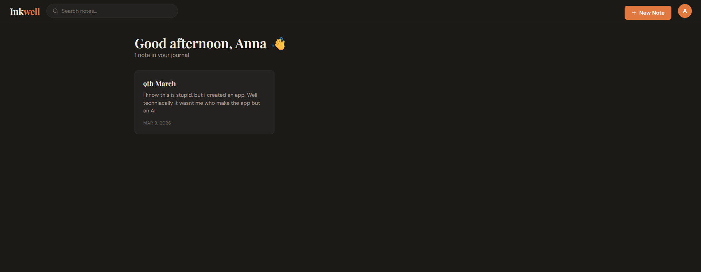
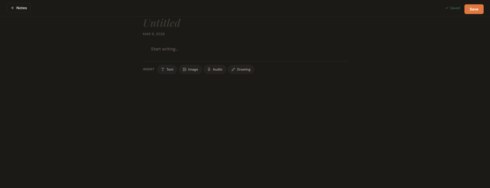
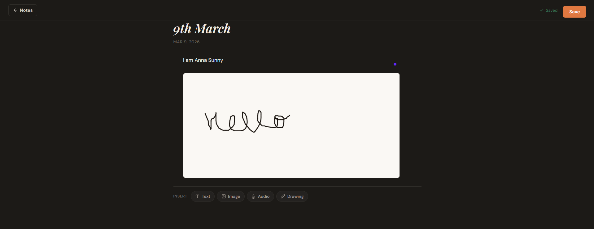

# InkWell

InkWell is a minimalist personal journaling app built as a single file web application.
It allows users to create rich journal entries containing text, images, audio recordings, and drawings, all stored securely in the cloud.

The goal of InkWell is to provide a distraction free writing environment while still supporting multimedia journaling.

## Features

• User authentication using Supabase
• Create and edit journal entries
• Text blocks for writing notes
• Image uploads
• Voice recordings directly from the browser
• Drawing canvas for sketches
• Dark mode toggle
• Pin important notes
• Search notes instantly
• Real time syncing between devices
• Export notes to CSV

All notes are stored in a Supabase PostgreSQL database and synced automatically across devices.

## Tech Stack

Frontend
React (via CDN)
JavaScript (Babel in browser)
HTML + CSS

Backend
Supabase
PostgreSQL database
Supabase Storage for media files
Supabase Authentication

The entire application runs from a single HTML file without any build tools or frameworks.

## Project Structure

```
InkWell
│
├── notes-app.html
├── README.md
├── LICENSE
└── screenshots
    ├── dashboard.png
    ├── notes.png
    └── drawing.png
```

## Setup

1. Create a Supabase project.

2. Create the **notes** table using SQL

```
create table if not exists public.notes (
  id uuid primary key default gen_random_uuid(),
  user_id uuid not null references auth.users(id) on delete cascade,
  title text not null default '',
  blocks jsonb not null default '[]'::jsonb,
  pinned boolean not null default false,
  created_at timestamptz not null default now(),
  updated_at timestamptz not null default now()
);
```

3. Enable Row Level Security and create policies so users can only access their own notes.

4. Create a storage bucket named

```
note-media
```

5. In `notes-app.html` add your Supabase credentials

```
const SUPABASE_URL = "your-project-url"
const SUPABASE_ANON = "your-anon-key"
```

6. Open the HTML file in a browser.

## Usage

1. Register an account
2. Create a new note
3. Write text or add media blocks
4. Notes automatically save and sync across devices

InkWell works on both desktop and mobile browsers.

## Screenshots

Dashboard



Note Editor



Drawing Canvas



## Future Improvements

• Mobile PWA version
• Markdown support
• Tagging and folders
• AI assisted journaling prompts
• Offline mode

## License

This project is licensed under the MIT License.
